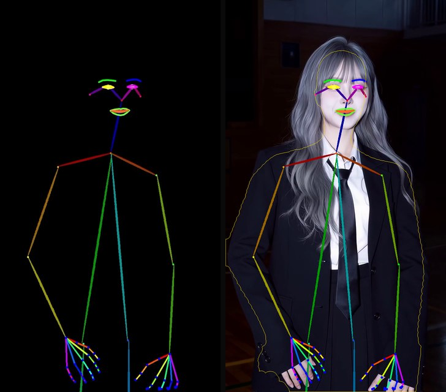

# ComfyUI-SAM3DBody-BetaSwap

A drop-in extra node for [PozzettiAndrea/ComfyUI-SAM3DBody](https://github.com/PozzettiAndrea/ComfyUI-SAM3DBody)
that replaces plain skeleton-pose rendering with a **body-shape- and
proportion-aware** swap for [Kijai's WanAnimate](https://github.com/kijai/ComfyUI-WanVideoWrapper)
pipeline: the driver's *motion* stays 100% driver, but the pose skeleton fed
to Wan is reshaped to the *reference character's* proportions before
rendering — height, build, limb length, headwear clearance, even clothing
volume — so the generated body actually matches the reference instead of
just wearing the driver's skeleton.



## Why bother (results in practice)

From testing, not something the code itself claims — without `BetaSwapPoseRender`, WanAnimate has no idea what the reference's body actually looks like under clothing: it commonly renders a generic torso that's noticeably thinner or bulkier than the reference, and complex accessories or animal-ear-type headwear are prone to coming out wrong or missing because nothing tells the model how much clearance they need above the skull. With BetaSwap on, resemblance to the reference is clearly higher — not a night-and-day transformation, but the build difference actually shows up *in the clothing* (not just the face), and those failure modes are visibly less frequent, because the model is now working from measured proportions and headwear clearance instead of guessing.

## What it does (verified against the node's own tooltips/source, not guessed)

Standard WanAnimate pose rendering draws the driver's skeleton as-is — a
tall reference character ends up with the driver's short arms, a
head-and-shoulders reference photo gives no idea what the body build should
be, hats clip into hair, faces don't take on the reference's proportions.
`SAM3DBodyBetaSwapPoseRender` runs [Meta's SAM 3D Body](https://github.com/facebookresearch/sam-3d-body)
on both the driver and the reference and works out, per frame, how to bend
the driver's *motion* onto the reference's *body*:

- **Height** — measures the swap/driver skeletal height ratio (pose-invariant
  bone-chain sums, EMA'd over frames) and shifts the figure in depth so the
  projected size matches, anchoring the pelvis pixel to the driver's so
  footing doesn't jump.
- **Build / limb thickness** — measures how much bulkier or thinner the
  reference body is than the driver's and scales stick width and mask
  silhouette accordingly (auto by default, tunable).
- **Clothing volume** — measures how much wider a *clothed* reference
  silhouette is than its bare MHR mesh (per zone: torso / thigh / shin,
  via GrabCut or a provided mask) and re-adds that volume to the mask so
  Wan has room to draw the actual outfit instead of being capped by the
  driver's segmentation.
- **Multi-reference body/face split** — an optional second reference image
  (`reference_body_image`) supplies body *form* (shape + scale) while the
  main reference supplies *identity* (face) — for when your best face
  reference is a head crop with no body to measure from.
- **Headwear clearance** — measures how much room whatever is worn on the
  reference's head needs above the bare skull and opens the mask by that
  much every frame, so hats/hair aren't clipped.
- **Face shape** — scales the driver's dlib68 face landmarks about the nose
  tip by the reference head-size ratio, so face geometry follows the
  reference's proportions while expression stays 100% driver.
- **Driver hands, always** — hand pose is always taken from the driver
  (POSEDATA), independent of body retargeting.
- **Temporal smoothing / jitter filter** — both auto by default: an EMA on
  the swap-minus-driver *offset field* (not the points), so driver motion
  passes through with no lag and only per-frame SAM3D recon noise gets
  smoothed; the jitter filter measures the driver recon's own noise floor
  per clip and only smooths as far as needed to match it.
- **Diagnostics** — optional, measurement-only: writes a per-frame CSV
  (jitter before/after, scale factors, mask block flips) and a reference-mesh
  report next to ComfyUI's output folder. Changes no output pixel.

Full parameter-by-parameter behavior is documented in the node's own
tooltips (`INPUT_TYPES` in `nodes/beta_swap_pose_render.py`) — that's the
source of truth, not this README.

## Base workflow credit

The surrounding WanAnimate pipeline (pose/face detection → segmentation →
LoRA-blended WanVideo animate) started from [MDMZ's Wan 2.2 Animate: Swap
Characters & Lip-Sync workflow](https://www.runcomfy.com/comfyui-workflows/wan-2-2-animate-swap-characters-lip-sync-workflow-comfyui) —
credited there as built in collaboration with MDMZ, using Kijai's
`ComfyUI-WanAnimatePreprocess` and `ComfyUI-WanVideoWrapper`. This repo's
copy has junk nodes removed, settings changed, auto-resolution added, and
multi-reference + the `BetaSwapPoseRender` node stitched in — enough
changes that it's a different workflow, but the base structure and idea are
MDMZ's.

## Requirements

- [ComfyUI-SAM3DBody](https://github.com/PozzettiAndrea/ComfyUI-SAM3DBody) installed and working
  (provides `LoadSAM3DBodyModel`, `.process` helpers this node imports)
- [Kijai's ComfyUI-WanAnimatePreprocess](https://github.com/kijai/ComfyUI-WanAnimatePreprocess)
  (or `-V2`) installed **next to** `ComfyUI-SAM3DBody` in `custom_nodes/` —
  the node locates it by walking up from its own folder and looking for
  that directory name, and dynamically loads `pose_utils/pose2d_utils.py`,
  `pose_utils/human_visualization.py`, and `utils.py` from it. It will not
  import without this.
- [ComfyUI-WanVideoWrapper](https://github.com/kijai/ComfyUI-WanVideoWrapper) for the animate/sampling side of the workflow
- Tested on an RTX 4090 24GB / 64GB system RAM. A 24-frame 720×1280 test
  clip: SAM3DBody recon + full BetaSwap retargeting + WanAnimate sampling
  (4 steps) completed in ~130 seconds end to end.

## Install

`nodes/beta_swap_pose_render.py` is not a standalone package — it imports
`.process` from `ComfyUI-SAM3DBody` itself, so it has to live inside that
package's own `nodes/` folder:

```
copy nodes/beta_swap_pose_render.py  →  ComfyUI/custom_nodes/ComfyUI-SAM3DBody/nodes/beta_swap_pose_render.py
```

**Unverified — check this yourself:** whether `ComfyUI-SAM3DBody` auto-scans
everything in its `nodes/` folder or needs an explicit import added to its
own `nodes/__init__.py`. I haven't opened that file, so I'm not claiming
either way. If the node "SAM 3D Body: beta-Swap Pose Render (Wan Animate)"
doesn't show up in ComfyUI after restart, that import line is what's
missing.

## Workflow

`workflows/1-Beta_multiref.json` — the full pipeline: driver video →
pose/face detection → SAM2 segmentation → `SAM3DBodyBetaSwapPoseRender`
(multi-reference: separate body-form and face-identity images) → WanAnimate
sampling with the relight + lightx2v LoRAs. Load your own driving video
into the `VHS_LoadVideo` node and your own reference images into the
`LoadImage` nodes, point `LoadSAM3DBodyModel` at your local
`ComfyUI/models/sam3dbody` folder.

## tools/CONVERTER.bat (optional)

A drag-and-drop helper for prepping phone footage. Drop any video file
onto it (anything ffmpeg can read — iPhone `.mov`, `.mkv`, etc.), pick a
preset (1920×1080, 1280×720, or 720×1280 portrait), and it re-encodes to
h264/yuv420p with the content letterboxed (not cropped) into that
resolution — a safe, known-good input format for the workflow. Requires
`ffmpeg` on `PATH`. Windows only (uses PowerShell for the preset picker).

## Author

Node code (everything past the base WanAnimate pipeline) by
[stark622](https://github.com/stark622).

## License

MIT — see [LICENSE](LICENSE). Covers this repo's code only. Running it
requires ComfyUI-SAM3DBody (MIT wrapper / Meta's SAM License for the
vendored model code) and Meta's SAM 3D Body weights specifically (Meta's
own SAM License — permits commercial use, with restrictions around
military/weapons/export-control) — installing those means accepting their
terms separately, not this file's.
